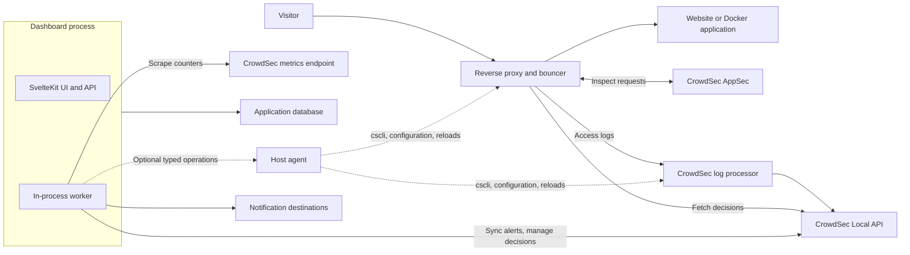

# Self-hosted CrowdSec Dashboard — Specification and Implementation Plan

**Date:** 9 October 2026  
**Status:** Proposed specification, revised 9 October 2026 after a review against a live host and the inspiration project; implementation has not started.  
**Primary stack:** SvelteKit 3, Svelte 5, TypeScript, Tailwind CSS, Drizzle ORM, local libSQL, Better Auth.  
**UI toolkit:** shadcn-svelte/Bits UI, Lucide Svelte icons, LayerChart, and TanStack Table for Svelte.  
**Security engine:** CrowdSec Security Engine, AppSec WAF, and compatible remediation components (bouncers).  
**Review changes:** summarized in Appendix A; observations from the reference host are in Appendix B.

## 1. Product objective

Build an open-source application that helps an administrator install, configure, verify, and operate protection for websites and applications on a server through a clear UI.

The application must explain what is protected, show evidence that protection works, help resolve configuration problems, and notify the administrator when action is needed. It must work locally and support Docker deployment, applications running in Docker, and websites behind Cloudflare.

Use CrowdSec for behavioral detection, security decisions, and AppSec request inspection. Build the management experience and integration automation around those components. Reading access logs provides detection after requests occur; inline AppSec inspection provides WAF protection for the current request. These are separate capabilities and must have separate status indicators. [CrowdSec architecture](https://docs.crowdsec.net/docs/intro/), [AppSec overview](https://docs.crowdsec.net/docs/appsec/intro/).

### Primary user journey

1. Install the application and create an administrator account.
2. Connect an existing CrowdSec installation or prepare a managed installation.
3. Discover or add websites, reverse proxies, and container applications.
4. Review the proposed configuration and enable protection.
5. Verify log acquisition, client IP handling, decision enforcement, and WAF inspection.
6. Configure notifications and operate the installation from the dashboard.

## 2. Agreed scope and defaults

| Area | Decision |
| --- | --- |
| Framework | Use SvelteKit 3 for the application. Astro was evaluated and rejected for the app (section 3.1); it may power the separate documentation site. |
| UI foundation | Tailwind, shadcn-svelte/Bits UI, Lucide Svelte icons, LayerChart, and TanStack Table; verify the selected versions together. |
| Initial topology | One managed Linux server per dashboard installation. Preserve server identifiers in the data model for later expansion. |
| Host topologies | Support (a) everything in Docker, (b) native CrowdSec with a Dockerized proxy and applications, and (c) everything native on Debian/Ubuntu. Topology (b) is the reference host (Appendix B). |
| CrowdSec versions | Set the minimum version in phase 0 from the features actually used (LAPI allowlists, bouncer usage metrics, AppSec). Test the previous minor (1.7.x; the reference host runs 1.7.6) and the current release (1.8.1 at review). |
| Process model | One dashboard container/process runs the web app and the background worker. An optional, separately deployed agent holds every privileged capability (section 4). |
| Delivery strategy | Guided setup (generate configuration, user applies, dashboard verifies) ships for all three proxies before automated managed apply. Managed apply reuses the same templates and checks. |
| Remediation | Ban by default; captcha/challenge only where the selected bouncer supports it. Durations and escalation come from CrowdSec profiles. |
| Site attribution | `target_fqdn` from CrowdSec alert context (`crowdsecurity/http_extended`), per-event metadata, and per-site log sources (section 5.2). |
| Ban scope | A ban applies across all configured protection entry points on that server. |
| Website separation | Separate inventory, filtering, attribution, and statistics; enforcement decisions remain shared. |
| Website-only bans | Deferred. Do not expose website-only ban or unban controls in v1. |
| Web servers | Support Caddy, Nginx, and Traefik with an explicit tested compatibility matrix. |
| Containers | Support Docker Compose deployment and protection of Docker-hosted applications. |
| Cloudflare | Optional integration for origin configuration checks and edge decision enforcement. Must work on the Cloudflare Free plan: the default edge mode is a dashboard-owned IP list plus one WAF custom rule per selected zone (section 6.3); the Worker bouncer is an optional mode for paid plans or Turnstile captcha. |
| License | MIT. |
| Storage | Local libSQL file managed through Drizzle, persisted independently of containers. |
| Authentication | Better Auth with local accounts; no external identity provider required. |
| Notifications | In-app inbox, SMTP email, ntfy, Gotify, and generic webhooks, plus Discord, Slack, and Telegram presets built on the webhook adapter. |
| Distribution | GitHub source, SemVer releases from v0.1.0 onward (section 13), versioned GHCR images, and a documentation site published from the repository. |
| Telemetry | Application telemetry disabled by default. Explain CrowdSec community participation separately. |

"Server-wide" means all entry points explicitly configured to enforce the shared decisions. Installing the dashboard alone does not attach protection to every service. SSH and other non-HTTP services require a suitable infrastructure bouncer; firewall management is a later capability.

The dashboard must require no SaaS account for its core local functions. Document CrowdSec's own connectivity, Hub update, and community-sharing behavior separately. Do not advertise a fully disconnected installation until that operating mode has been tested.

### v1 release boundary

The complete v1 target includes all three proxy integrations, guided configuration, verification, Docker deployment, optional Cloudflare enforcement, notifications, backup/restore, and GitHub releases. Earlier milestones deliver smaller working subsets; a Traefik-only milestone is not the completed v1 product.

Initial production support targets a documented Debian/Ubuntu Linux baseline and Docker Engine/Compose. macOS Docker Desktop can support development and container demonstrations. Native macOS/Windows service and firewall management are outside the first support matrix.

## 3. SvelteKit 3 requirements

SvelteKit 3 was announced on 1 October 2026. Its migration guide specifies minimum versions of Node 22.17, TypeScript 6, Svelte 5.57.1, Vite 8.0.12, and `@sveltejs/vite-plugin-svelte` 7. Select supported patched versions and pin the resolved dependency set during the initial compatibility milestone. [Release announcement](https://svelte.dev/blog/sveltekit-3-is-here), [migration guide](https://svelte.dev/docs/kit/migrating-to-sveltekit-3).

### 3.1 Framework choice: SvelteKit versus Astro

Astro is a strong fit for content sites. It is a weak fit for this product, which is an authenticated application with no public content pages. Every screen is dynamic, filters and live status are shared across the page, and a persistent server process must run synchronization, jobs, and an event stream. In Astro most of the UI would become Svelte islands, with cross-island state, client navigation, and the background worker implemented outside the framework's main model. SvelteKit provides those pieces directly: nested layouts, server loads, progressively enhanced form actions, client routing, and a long-running Node server.

Decision: build the application with SvelteKit 3. Astro (Starlight) may be used for the separate documentation site, which is content and benefits from Astro's strengths.

Alternatives considered:

- Hono + React, as used by the inspiration project. Viable, but it duplicates routing, data loading, and form handling that SvelteKit already provides.
- A single Go binary with server-rendered UI. Lowest memory footprint and simplest native install, but slower UI iteration and a weaker component ecosystem for charts and tables. The optional agent uses Go where a small footprint matters most (section 4).

The UI framework will not be the performance bottleneck for a single-administrator dashboard. Synchronization design, database queries, and bundle size are; section 12 sets the budgets.

### 3.2 Implementation conventions

- Use the SvelteKit Vite plugin and `vite.config.ts`; do not introduce `svelte.config.js`.
- Use `#lib` subpath imports and explicit module extensions following the new conventions.
- Use Svelte 5 and `$app/state`; keep private environment access and secret handling in server-only modules.
- Declare runtime variables in `src/env.ts` with `defineEnvVars` and read them through `$app/env/private`, as the scaffold already does. Add `CROWDSEC_LAPI_URL`, machine credentials (or `_FILE` variants), the metrics URL, the agent socket/URL, and the encryption-key file there.
- Deploy with `@sveltejs/adapter-node` as a persistent Node server. [Node adapter](https://svelte.dev/docs/kit/adapter-node).
- adapter-node 6 (the Kit 3 release) has no runtime `ORIGIN` variable. It takes the origin from build-time configuration, or from request headers with the protocol defaulting to `https`. Over plain HTTP, such as `http://localhost:3000` in Docker, every form POST then fails the CSRF check with 403. A build-time origin would bake one hostname into the published image. Use a small custom server entry around the adapter's handler that pins the public origin from a runtime variable (the same one Better Auth uses as `baseURL`). Behind a reverse proxy, trust `PROTOCOL_HEADER`/`HOST_HEADER` only from that proxy.
- Before phase 1, remove scaffold-only pieces: `adapter-auto`, `mdsvex`, `@sveltejs/enhanced-img`, the `typography` plugin if unused, and the demo routes.
- Start the in-process worker exactly once from the server `init` hook (verify the hook in Kit 3 during phase 0). Guard it with a database lease so a second process or a dev-server reload cannot run a second scheduler.
- Use stable server loads, form actions, and HTTP endpoints for v1. Remote functions and Async Svelte remain experimental at the research date and are not required for the product.
- Validate the trusted public origin and reverse-proxy headers for authentication, cookies, CSRF, and rate limiting.

Better Auth's current SvelteKit guide still contains older import conventions. Treat it as integration guidance that needs adaptation and an actual compatibility test, not proof that its examples can be pasted into Kit 3 unchanged. Verify session population, server-action cookies, and the Drizzle adapter in the production build. [Better Auth SvelteKit integration](https://better-auth.com/docs/integrations/svelte-kit), [Drizzle adapter](https://better-auth.com/docs/adapters/drizzle).

Better Auth features to use rather than rebuild: the `admin` plugin for roles and user management, the `twoFactor` plugin for TOTP and backup codes, built-in rate limiting with database storage so limits survive restarts, and `emailAndPassword.disableSignUp` once the first administrator exists. The scaffold imports `better-auth/minimal`; confirm that each selected plugin works with that entry point.

Probe findings (Appendix C): Better Auth 1.7.7 still declares an optional peer of `@sveltejs/kit ^2.0.0`, so a clean `npm install` fails with `ERESOLVE` against Kit 3. Sign-up, sign-in, session, and sign-out nevertheless work in dev and in the adapter-node build. Until upstream declares Kit 3, resolve the peer with a scoped package-manager override, preferred over a global `legacy-peer-deps`, and track the upstream issue. The scaffold ships a placeholder `auth.schema.ts`; run `npm run auth:schema` before the first migration.

### 3.3 UI, icons, charts, and supporting libraries

Use a consistent Svelte toolkit and shared design tokens across dashboards, setup, investigations, and settings. The package choices below are planning defaults; phase 0 must verify their current stable releases with Kit 3 and the production bundle.

| Need | Selected approach | Intended use |
| --- | --- | --- |
| Styling | Tailwind CSS with `@tailwindcss/vite` | Layout, responsive screens, light/dark themes, spacing, typography, and semantic color tokens |
| UI components | shadcn-svelte components built on Bits UI and Tailwind | Dialogs, dropdowns, tabs, command search, date ranges, sidebar, forms, tooltips, and status badges |
| Icons | Lucide's current `@lucide/svelte` package | Navigation, services, health, actions, notifications, and rule types; explicit icon imports |
| Charts | `layerchart` with shadcn-svelte chart components | Time series, bars, stacked activity, sparklines, axes, tooltips, and legends |
| Data tables | `@tanstack/svelte-table` with shadcn-svelte table components | Alert/decision tables, columns, sorting, selection, and controlled server pagination |
| Validation | One shared runtime-schema library, proposed Zod | Server request validation, form errors, typed contracts; confirm the selected package in phase 0 |
| Class composition | The shadcn-svelte utility convention | Consistent variants and Tailwind class composition without a second styling system |
| Transient feedback | shadcn-svelte's Svelte-compatible toast component | Saved settings and immediate action feedback; durable notifications stay in the inbox |
| Optional topology graphs | `@xyflow/svelte` (Svelte Flow), when the topology view is implemented | Read-only relationships between sites, proxies, security components, and Cloudflare bindings |

shadcn-svelte supplies component source that the project owns and maintains. Keep only the required components, adapt generated imports/configuration to Kit 3, and verify any CLI changes before applying them. Its chart components use LayerChart, and its current data-table guide uses TanStack Table v9; select matching APIs rather than mixing older examples. [shadcn-svelte](https://www.shadcn-svelte.com/docs), [chart components](https://www.shadcn-svelte.com/docs/components/chart), [data tables](https://www.shadcn-svelte.com/docs/components/data-table).

Use Lucide's documented current package/import paths, not a stale package name from an older tutorial. Import only used icons; give icon-only buttons accessible labels, keep decorative icons hidden from assistive technology, and pair health icons/colors with text. [Lucide Svelte](https://lucide.dev/guide/svelte/getting-started), [Tailwind Vite integration](https://tailwindcss.com/docs/installation/using-vite).

Charts required for v1:

- Detection and observed WAF activity over time, with source and coverage clearly labeled.
- New/expired decisions and the active shared server decision count.
- Most frequent scenarios/rules and attributed website activity.
- Acquisition/parsing trends and bouncer synchronization freshness.
- AppSec latency summaries only where reliable upstream measurements exist.
- Notification successes/failures and operational incidents over time.

Chart rules:

- Share the page's website/server/time filters and support click-through to the underlying filtered records.
- Distinguish missing data from a measured zero. Show stale/partial coverage and gaps.
- Aggregate on the server, bound chart point counts, and downsample long time ranges; never load the entire alert history into the browser to draw a graph.
- Keep series labels, colors, units, timezone formatting, and accessibility consistent. Supply a textual summary or data table alongside meaningful graphs.
- Avoid double-counting shared server decisions in website totals and avoid presenting all detected events as blocked requests.
- Lazy-load visualization features that are not needed on the current screen; verify SSR, hydration, resize, dark mode, and reduced-motion behavior.
- Use LayerChart for statistical graphs. Add Svelte Flow only for a topology view, with a keyboard-accessible list equivalent; do not turn infrastructure diagrams into a configuration editor in v1. [Svelte Flow](https://svelteflow.dev/).

## 4. System architecture

### Components

| Component | Responsibility | Runtime / storage |
| --- | --- | --- |
| Web application | UI, authentication, authorization, read APIs, validated mutation requests, event stream | SvelteKit 3 with Node adapter |
| Worker | CrowdSec synchronization, metric sampling, durable jobs, notification delivery, scheduled checks | Same Node process and image as the web application by default, started once from the `init` hook under a database lease; can run as a second process from the same image if measurements justify it |
| Host agent (optional) | Inventory, `cscli` bridge, constrained configuration operations, validation, service/container reloads, rollback | Small Go service: one static binary for native hosts and a small container image for Docker hosts |
| Application database | Accounts, inventory, cached alerts, configuration revisions, jobs, notification history, audit events | Drizzle + local libSQL |
| CrowdSec | Log acquisition, parsing, scenarios, decisions, AppSec inspection | Existing upstream components and their own storage |
| CrowdSec metrics | Acquisition, parser, scenario, AppSec, LAPI, and active-decision counters | CrowdSec Prometheus endpoint (default port 6060), read-only |
| Proxy integration | Fetch shared decisions and forward requests for AppSec inspection | Caddy module, Nginx/OpenResty bouncer, Traefik plugin |
| Cloudflare integration | Deploy/adopt explicitly managed resources and synchronize decisions to selected routes | Upstream Cloudflare Worker bouncer or a dashboard-owned IP-list sync; see section 6.3 |

Protection must continue when the web application or its worker is restarted. The dashboard is not in the website request path. Bouncer behavior during LAPI or AppSec outages is a separate, explicit policy.

Cloudflare adds an optional edge enforcement layer in front of the proxy. Prefer a locally running upstream bouncer that reads the local decision feed and pushes to Cloudflare; this avoids making LAPI publicly reachable. [Cloudflare integration](https://docs.crowdsec.net/u/bouncers/cloudflare/).

### Boundaries

- Use the supported LAPI for alerts and decisions. Use a constrained agent and supported tools for administration that LAPI does not expose.
- Never read or mutate CrowdSec's internal database directly from application code.
- Give the web container no direct Docker socket, unrestricted shell, or host-root access.
- The agent exposes typed operations on enrolled resources; it is not a general-purpose remote terminal.
- The worker owns polling and schedules; page loads and browser connections must not start duplicate background loops.
- Start with a durable database queue and one in-process worker. Redis, a message broker, and Kubernetes are unnecessary v1 dependencies.
- Live updates use one server-side event bus fed by the worker and fanned out over Server-Sent Events. Browser widgets do not poll the server independently.
- Keep native libSQL dependencies in the Node runtime and verify production bundling for both image architectures. [Drizzle SQLite/libSQL support](https://orm.drizzle.team/docs/sqlite/get-started-sqlite).

### CrowdSec access and capability tiers

LAPI does not expose everything an administrator needs. Bouncer lists, bouncer usage metrics, Hub items, simulation, contexts, and allowlist writes are only available through `cscli`, which reads CrowdSec's own database and files. The dashboard therefore detects which tiers are available and enables features per tier. Every unavailable action falls back to showing the exact command or configuration file to apply, followed by a **Verify** button.

| Tier | Access | Credentials / requirement | Unlocks |
| --- | --- | --- | --- |
| A. LAPI watcher | `GET /v1/alerts` (with `since`, `limit`, origin, scenario, and active-decision filters), `POST /v1/alerts` (manual decisions), `DELETE /v1/decisions`, `DELETE /v1/alerts`, `GET /v1/allowlists` and `/v1/allowlists/check/{ip}` | Machine registered with `cscli machines add <name> --password 
 -f /dev/null`, or agent mTLS | Alerts, alert context, local decisions, manual ban/unban, allowlist reads and IP checks |
| B. Observer bouncer key (optional) | `GET /v1/decisions?ip=` and `GET /v1/decisions/stream` | Dedicated, clearly named bouncer key that never enforces | Per-IP lookups across all origins, including the community blocklist, without downloading CAPI alerts |
| C. Metrics endpoint | Prometheus text from port 6060 | Network reachability only; no credentials | Lines read/parsed/unparsed per source, parser and scenario activity, AppSec processed/blocked counters, LAPI request rates, active decisions by origin |
| D. `cscli` bridge | `cscli <command> -o json` executed by the agent (`docker exec` on Docker hosts, direct execution on native hosts) | Agent | Bouncers and machines with last pull, bouncer usage metrics (the only source of observed dropped/blocked counts), Hub, simulation, contexts, allowlist writes, `cscli explain`, `cscli setup detect`, LAPI/CAPI/Console status |
| E. Managed files and reloads | Owned files in `acquis.d`, `profiles.yaml`, AppSec acquisition, proxy configuration; service/container reloads | Agent with scoped mounts/paths | Guided changes applied automatically with diff, validation, and rollback |

Running `cscli` inside the CrowdSec container needs Docker exec, which is equivalent to host root. Only the agent may hold the Docker socket, and the UI must say so when the administrator enables tier D or E.

### Operation modes

**Connect mode (tiers A–C):** connect to an existing installation, inspect it, and monitor it. No configuration changes. Management actions appear only when the required tier is available.

**Guided mode (tiers A–C plus the administrator):** generate exact configuration, Compose snippets, and commands for the detected topology; the administrator applies them; the dashboard then runs the verification checks in section 5.6. Show clearly that generated output has not been applied until verification passes. This is the first setup experience delivered (section 13), not merely a fallback.

**Managed mode (tiers D–E):** install or adopt supported components through the agent and apply the same generated configuration through the lifecycle in section 5.6.

## 5. Functional specification

### 5.1 Onboarding and discovery

- Bootstrap the first administrator through a local/one-time setup credential so an exposed fresh instance cannot be claimed by an arbitrary visitor.
- Connect to LAPI using the required watcher credentials or supported mTLS; keep bouncer credentials separate.
- Discover proxy versions, installed modules, existing configuration, Docker containers/networks, log locations, and available management capabilities.
- Treat discoveries as suggestions. Let the administrator review resources before adopting them.
- Offer a connection test with a useful diagnosis: authentication failure, unreachable service, TLS issue, missing module, unreadable logs, or unsupported version.
- Support both existing infrastructure and a new example Compose stack.
- Save resumable setup progress; explain any required reload and its expected effect.

### 5.2 Server and website inventory

- Represent the server, proxy entry points, websites, aliases, container applications, data sources, bouncers, and Cloudflare bindings as separate objects.
- Track which proxy routes enforce shared server decisions and which forward requests to AppSec.
- Attribute events from dedicated log sources, hostnames, and router/container metadata. Preserve the evidence used for attribution.
- Allow an event/alert to reference several sites when warranted. Show unattributed or ambiguous events explicitly.
- Do not equate a Cloudflare zone with one website: a zone can contain multiple relevant hostnames.
- Keep list/search/filter state in URLs so investigations can be bookmarked and shared locally.

**How attribution works.** CrowdSec does not label alerts with a website by default. Use these signals, in order of confidence, and store which one was used:

1. Alert context key `target_fqdn`. It is added by the `crowdsecurity/http_extended` context, which reads `evt.Meta.target_fqdn` for log-based detections and `req.Host` for AppSec. The default `crowdsecurity/http_base` context does not include it. Setup must install `http_extended` (guided command or tier D) and show attribution as unavailable until it is present.
2. Per-event `target_fqdn` metadata, set by the parsers only when the log contains the host:
   - Caddy: JSON access logs carry `request.host`.
   - Traefik: JSON access logs carry `RequestHost`. The common log format does not carry it, so recommend JSON.
   - Nginx: the default `combined` format has no host. Recommend a log format that prefixes `$host`, which the Nginx parser recognizes, or one access log file per site.
3. Per-event `datasource_path` (the log file) or container name, mapped to a site when each site has its own log source.
4. Otherwise the event is **unattributed**. Show unattributed counts so the administrator can fix logging rather than guess.

Alert context is sent to LAPI regardless of the Console `share_context` setting, which only controls forwarding to the CrowdSec Console. Verify this on each supported CrowdSec version.

### 5.3 Dashboard and investigations

- Show active decisions, detected alerts, WAF activity, integration health, and unresolved configuration problems.
- Provide server and website filters, a time range, scenario/rule filters, simulation status, IP/CIDR search, and origin/source filters.
- Offer a chronological alert detail view with associated decisions, affected sites, available event context, and relevant integration status.
- Provide saved searches and CSV/JSON export with permission checks and redaction.
- Display cached data during outages with its age, last successful sync, and partial-data status.
- Keep decision counts, detection counts, and observed blocked-request counts distinct. A ban does not prove a request was blocked. Observed blocked counts come only from bouncer usage metrics (tier D) or AppSec block counters (tier C); label the source.
- Prefer useful trends and health summaries first. Optional geolocation/map enrichment must not send visitor IPs to external services by default.
- Use the country, AS, range, and coordinates that CrowdSec's GeoIP enrichment already adds to each alert source. Render the attack map from a bundled world geometry with no external tile server. An optional CrowdSec CTI lookup (administrator-supplied API key, explicit per-IP action) can add reputation details.
- Treat the community blocklist as aggregate data. A typical host holds tens of thousands of CAPI decisions (21,286 on the reference host) in a few large alerts. Exclude CAPI and list origins from the alert sync by default; show their volume from the `cs_active_decisions` metric and answer "is this IP listed?" with a per-IP lookup (tier B). Never render or store the full list for display.
- Show simulated alerts and decisions as simulated, with a filter, rather than mixing them with enforced decisions.

### 5.4 Decisions and allowlists

- Support manual IP/CIDR bans with a duration, reason, and visible **Apply to this server** scope. Offer `captcha` as a decision type only when every selected entry point's bouncer supports it; otherwise explain which entry points would treat it differently.
- Offer **Allowlist my current IP** and private-range presets during setup and on the decisions page, so administrators and monitoring services are not banned. Show the client IP as the dashboard sees it and warn when it looks like a proxy address.
- Distinguish the allowlist mechanisms: centralized allowlists (`cscli allowlists`, readable through LAPI; confirm per version which components apply them), parser whitelists (for example `crowdsecurity/whitelists` for private ranges, which stop events before scenarios), and bouncer-level trusted IPs. Show which one matched when an IP is checked.
- Show the affected entry points and associated Cloudflare bindings before application.
- Provide unban, expiration, source/origin filtering, and explanations for decisions that remain active from another source.
- Normalize IPv4/IPv6 and CIDRs; validate ranges and configurable duration limits.
- Manage server-level allowlists using supported CrowdSec/integration mechanisms. Verify the semantics for manual, scenario, and community decisions separately.
- Provide an emergency local recovery procedure for administrator lockout.
- Keep browser acknowledgement of an alert separate from remediation and decision deletion.

Standard remediation components consume IP/range decisions; website filtering in the UI does not make these decisions website-scoped. The v1 shared-feed policy is intentional. [Bouncer specifications](https://docs.crowdsec.net/docs/contributing/specs/bouncer_appsec_specs/).

### 5.5 Rule and WAF management

- List installed collections, parsers, scenarios, AppSec configurations, and available updates.
- Install/update/remove supported Hub items through validated jobs, with dependency and impact information.
- Enable log detection and AppSec independently; use a shared server policy initially.
- Support simulation/observe modes where the selected upstream component supports them. Display capability differences rather than assuming one universal switch.
- Add targeted exceptions through supported configuration; show their scope and log who created them.
- Explain request-size limits, inspection exclusions, latency, and fail-open/fail-closed behavior.
- Separate immediate AppSec blocking from later behavioral IP bans and their expiration.
- Keep free-form parser/scenario/rule authoring out of the basic setup flow. Provide an advanced import/configuration view later.

**WAF protection levels.** Present AppSec as named presets built from Hub collections, so administrators choose a risk level instead of composing rules:

| Level | Hub content | Behavior | False-positive risk |
| --- | --- | --- | --- |
| 1. Virtual patching (default) | `crowdsecurity/appsec-virtual-patching` with the `appsec-default` configuration | Blocks requests matching known CVE exploits in-band | Low |
| 2. Generic rules | Level 1 plus `crowdsecurity/appsec-generic-rules` | Adds generic attack patterns in-band | Low to moderate |
| 3. OWASP CRS, observe | Level 2 plus `crowdsecurity/appsec-crs` (out-of-band) | CRS matches create alerts without blocking; a scenario bans IPs that trigger several rules | Moderate, surfaced as alerts |
| 4. OWASP CRS, blocking | Level 2 plus `crowdsecurity/appsec-crs-inband` | Blocks CRS matches in-band | High; needs tuning and exclusions |

- Offer application exclusion collections where the site runs a known application (for example the CRS exclusion plugins for WordPress, Nextcloud, Drupal, and phpMyAdmin) and application-specific rule collections such as `crowdsecurity/appsec-wordpress`.
- Recommend level 3 before level 4 and show the CRS alerts a site would have blocked before allowing a move to blocking.
- The Hub also offers AppSec bot-challenge collections (proof-of-work challenge with strict/balanced/permissive thresholds). Treat them as a later, capability-gated option after confirming the CrowdSec and bouncer versions that support challenge responses.

### 5.6 Guided configuration and verification

Every configuration operation follows this lifecycle:

1. Discover the current state and identify the resources the application owns.
2. Generate a proposed configuration with a readable diff and impact summary.
3. Validate schema, component capabilities, paths, and component-native configuration checks.
4. Detect external changes since the preview; refuse to overwrite a changed base silently.
5. Record an audit event and create a recoverable configuration revision.
6. Apply staged changes with per-resource locks and atomic file replacement where supported.
7. Reload only the components that require it.
8. Run post-change health and protection checks.
9. Report success, partial application, or failure; roll back local changes when possible and explain any remaining external cleanup.

Multi-component changes are not assumed to be globally atomic. Persist each completed step so a crash can be reconciled safely. Never report a failed rollback as a successful operation.

Verification must cover:

| Check | Evidence to show |
| --- | --- |
| Logs acquired | Source readable; recent lines read; permissions and rotation checked |
| Logs parsed | Parser counters and a sample explanation; unparsed-line diagnosis |
| Client IP correct | Visitor identity evaluated through the actual trusted proxy chain |
| Bouncer healthy | Credentials accepted, recent decision fetch, reachable integration |
| Decisions enforced | Temporary controlled test decision produces the expected result at each selected entry point |
| WAF active | Owned test application/request triggers an expected rule with correlated AppSec or bouncer evidence |
| Cloudflare synchronized | Last successful update, selected route bindings, propagation status, and edge test evidence |
| Normal traffic works | Ordinary HTTP/API requests still succeed; relevant upload/WebSocket cases are checked |

A generic HTTP 403 is insufficient proof of WAF protection; it might come from the application or another layer. Tests need correlated evidence and must avoid banning the administrator's current IP. Temporary test changes require expiry and crash-safe cleanup. [Acquisition checks](https://docs.crowdsec.net/u/getting_started/post_installation/acquisition/).

Use CrowdSec's own harmless test triggers so checks are deterministic and never ban anyone:

- Log path: a request to `/crowdsec-test-NtktlJHV4TfBSK3wvlhiOBnl` triggers the `crowdsecurity/http-generic-test` scenario, which creates an alert with no decision. Evidence: the alert, its `target_fqdn`, and the acquisition counters for that log source.
- WAF path: the same path triggers the `crowdsecurity/appsec-generic-test` AppSec rule. Evidence: an inline block at the proxy plus a matching increase in the AppSec blocked counter and rule metrics.
- Test origin matters. Requests from private or allowlisted addresses are dropped by whitelists before scenarios run, so a log-path test from the dashboard container may only show up as a `whitelisted` acquisition count. Report that outcome as "logs reach CrowdSec, scenario not exercised" and offer a test from a non-allowlisted vantage point, rather than failing or passing silently.
- Unparsed lines: when the parsed count stays at zero, run `cscli explain` on a sampled line (tier D) and show which parser stage rejected it.
- Firewall bouncer coverage: when the host uses the firewall bouncer and applications publish Docker ports, check that the `DOCKER-USER` (iptables) or equivalent forward hook is covered. Banned IPs otherwise still reach containers, because published-port traffic does not traverse the `INPUT` chain.

### 5.7 Remediation profiles

Ban duration and escalation are configured in CrowdSec's `profiles.yaml`, not in the bouncers. The upstream default is a flat 4-hour ban.

- Show the effective policy in plain language, for example "First detection: 4 h ban. Each repeat adds 4 h."
- Offer presets: flat duration, escalating duration for repeat offenders (`duration_expr` using `GetDecisionsCount`), and captcha instead of ban for selected low-confidence scenarios when the bouncers support it.
- Manage per-scenario simulation (`simulation.yaml`) so new or noisy scenarios can be observed before they ban.
- Preserve existing custom profiles. Manage only a clearly owned profile block, show the diff, and apply it through the lifecycle in section 5.6 (guided output without the agent).
- Leave CrowdSec's own notification plugins untouched; the dashboard's notifications are configured separately (section 7).

### 5.8 Information architecture and key screens

Global elements: a sidebar, a header with the site filter and time range (both kept in the URL), a live/last-sync indicator, and a command palette (Ctrl/Cmd+K) that finds IPs, sites, pages, and actions.

| Screen | Content |
| --- | --- |
| Overview | Health strip (engine, LAPI, log sources, bouncers, WAF, Cloudflare) with state and timestamp; alerts, active local decisions, community blocklist size, and WAF blocks; activity chart; top scenarios, countries, and AS; attack map; open problems with **Fix** links |
| Sites | Per-site protection row (logs read, logs parsed, bouncer, WAF level, real IP, Cloudflare) with an activity sparkline; site detail shows the overview filtered to the site plus its setup checklist |
| Alerts | Filterable table with saved searches; detail view with timeline, context, events, decisions, and attribution evidence |
| Decisions | Active and expired decisions, add ban, allowlists, and origin breakdown including the community blocklist size |
| IP detail | Alert timeline, decisions from every origin, allowlist matches, geo/AS, optional CTI, and ban/unban/allowlist actions |
| Protection | Setup wizard, per-entry-point checks, WAF levels, remediation profiles, Hub items |
| Notifications | Inbox, channels, rules, delivery history |
| System | CrowdSec machines and bouncers with versions, capability tiers, agent status, jobs, audit log, backups, updates |
| Settings | Users and roles, authentication, appearance, time zone |

First-run setup wizard, resumable, each step revisitable from the Protection checklist:

1. Create the administrator with the one-time bootstrap credential.
2. Connect CrowdSec: probe common addresses (`http://crowdsec:8080`, the Docker host gateway, `127.0.0.1:8080`) and generate the machine-registration command for the detected Docker or native install.
3. Detect topology: proxy type and version, Docker, Cloudflare in front of the server (by request headers and DNS), and enabled tiers.
4. Add sites from discovered hostnames (proxy configuration, Docker labels, alert context).
5. Build a per-site protection plan: logging, parser collection, attribution context, bouncer, WAF level, real-client-IP handling, allowlist for the administrator's IP.
6. Apply (guided or managed) and verify with the checks in section 5.6.
7. Configure notifications.

### 5.9 Visual design direction

- A calm, information-dense operations UI. Dark and light themes following the system setting by default.
- One status vocabulary across the product: verified, degraded, failed, unknown/stale, and not configured. Each state has a color, an icon, and a text label; color is never the only signal.
- One UI sans-serif and one monospace face for IPs, ranges, hashes, and configuration. Use tabular numerals for counts and tables.
- Abbreviate large numbers (21.3k) with the exact value on hover; show relative times with the absolute time on hover.
- Configuration output uses syntax-highlighted blocks with copy buttons and a diff view; load the highlighter lazily.
- Empty states state the next action; error states state the cause and the fix.
- Subtle motion only, disabled under reduced-motion preferences.
- Before v0.1, run a dedicated design pass on four reference screens (overview, site detail, IP detail, one setup step) and derive the shared tokens from it.

## 6. Integration requirements

### 6.1 Reverse proxies

| Proxy | Detection | Enforcement / WAF | Management requirement |
| --- | --- | --- | --- |
| Traefik | Compatible access logs from files or container output | Current CrowdSec bouncer plugin; middleware attached to selected routers; AppSec forwarding enabled | Validate plugin/version and dynamic configuration; support Compose labels through a reviewed configuration workflow |
| Caddy | Compatible Caddy access logs | Community CrowdSec HTTP and AppSec modules | Build and publish a pinned custom Caddy image or adopt a compatible build; validate Caddy configuration and reload safely |
| Nginx | Compatible access logs | Supported Nginx/OpenResty bouncer with AppSec configured | Detect Lua/module/package prerequisites; publish tested deployment recipes; validate before reload |

Log collection and request enforcement are two separate setup steps. A parser being installed must not produce a green enforcement badge.

**Prerequisites the setup flow must check and generate per proxy.** None of the three proxies is ready by default:

| Proxy | Access logging | Real client IP in logs and bouncer | Bouncer component (latest release at review) |
| --- | --- | --- | --- |
| Caddy | Off by default; add a `log` directive per site with JSON output to a file or stdout | The CrowdSec parser reads `request.client_ip`, which equals the visitor only when `trusted_proxies` (and `client_ip_headers` for `CF-Connecting-IP`) are configured | `caddy-crowdsec-bouncer` v0.14.1 (HTTP, AppSec, layer4); requires a custom build, the stock `caddy` image does not include it |
| Traefik | Off by default; enable `accessLog` with JSON format so `RequestHost` is logged | Entry point `forwardedHeaders.trustedIPs`; plugin `forwardedHeadersTrustedIPs`/`clientTrustedIPs` and a custom header name for Cloudflare | `crowdsec-bouncer-traefik-plugin` v1.7.1 (live/stream modes, AppSec, captcha) |
| Nginx | On by default, but the `combined` format has no host; add a `$host`-prefixed format or per-site files | `real_ip_header` and `set_real_ip_from` for each trusted proxy range | `cs-nginx-bouncer` / `cs-openresty-bouncer` v1.2.3; needs the Lua module (for example `libnginx-mod-http-lua`) or OpenResty |

Popular packaged variants (Nginx Proxy Manager, SWAG, Pangolin) are candidates for the compatibility matrix after v1; the Nginx parser already recognizes Nginx Proxy Manager log formats.

Sources: [Traefik AppSec guide](https://docs.crowdsec.net/docs/appsec/quickstart/traefik/), [Caddy module](https://github.com/hslatman/caddy-crowdsec-bouncer), [Nginx/OpenResty guide](https://docs.crowdsec.net/docs/appsec/quickstart/nginxopenresty/).

### 6.2 Docker-hosted applications

- Protect HTTP applications at their reverse proxy, regardless of the application's own language/framework.
- Support mounted access-log volumes and CrowdSec's Docker acquisition source.
- Support explicit acquisition opt-in labels and container restart/recreation discovery. [Docker datasource](https://docs.crowdsec.net/docs/log_processor/data_sources/docker/).
- Keep Docker discovery/control in the agent or a tightly scoped API proxy; never expose the Docker socket to the web container.
- A read-only filesystem mount of a Unix socket does not restrict API methods on that socket.
- Detect directly published application ports that bypass the intended proxy and explain the protection gap.
- Avoid editing arbitrary Docker labels in place: label changes can require container recreation. Preview the generated Compose/configuration change and show the expected interruption.
- Reconcile persistent identifiers when containers are recreated; do not use transient container IDs as website identity.
- Test log rotation, unavailable logging drivers, stopped containers, networks, permissions, and duplicate acquisition.
- Mixed topology (native CrowdSec, Dockerized proxy): CrowdSec can read container output through the Docker datasource (the `crowdsec` service then needs Docker socket access) or read a log file the proxy writes to a bind-mounted host directory. Prefer the bind-mounted file: it avoids granting the engine socket access and survives container recreation.
- When the host runs the firewall bouncer, check that it covers Docker-published ports (section 5.6) and generate the `DOCKER-USER` chain setting when it does not.

### 6.3 Cloudflare

- Keep origin protection and edge enforcement separately visible and configurable.
- Detect selected proxied hostnames and validate token capabilities, route bindings, and supported account resources.
- Restore real visitor IPs and trust headers only from the verified proxy chain. Account for IPv6 and relevant header transformations. [Cloudflare visitor IP guidance](https://developers.cloudflare.com/support/troubleshooting/restoring-visitor-ips/restoring-original-visitor-ips/).
- Integrate the maintained upstream Cloudflare remediation mechanism or the dashboard-owned list sync described below; validate the exact version and resource lifecycle before offering automated installation.
- Prefer local decision polling and outbound synchronization; do not require public access to LAPI.
- Map each explicitly selected hostname/route binding to this server's policy. Do not implicitly protect every zone on the account.
- Track managed resource ownership, support adopting compatible existing resources, and delete only resources owned by this installation.
- Surface API limits, Worker quotas, synchronization lag, propagation delay, and failures. Worker failure behavior must be explicit.
- Use compatible observe/log-only modes for rollout when available.
- Clarify that origin access logs omit cache hits and edge-blocked requests. Full edge visibility needs a separate logging integration with available account datasets; it is a later enhancement. [Logpush](https://developers.cloudflare.com/logs/logpush/).
- Describe this integration as shared IP decision enforcement at the edge; do not imply that the CrowdSec AppSec engine runs inside Cloudflare or that Cloudflare's native WAF is being replaced.

**Origin setup comes first and does not need a Cloudflare token.** When a site is proxied by Cloudflare, every request reaches the origin from a Cloudflare address. Unless the proxy restores the visitor IP from `CF-Connecting-IP` and trusts it only from Cloudflare's published ranges, CrowdSec detects and bans Cloudflare edge addresses instead of attackers. This check belongs in guided setup (phase 5), long before edge enforcement:

- Detect Cloudflare in front of a site from DNS and response headers; generate the proxy's trusted-proxy configuration from Cloudflare's current IPv4/IPv6 ranges and keep it refreshed.
- **Cloudflare Tunnel (`cloudflared`)**: requests arrive from the `cloudflared` container or host address, not from Cloudflare ranges. Trust `CF-Connecting-IP` only from that address. Direct-port bypass checks matter less, but a published proxy port next to the tunnel is a bypass and must be reported.
- Recommend restricting origin ports to Cloudflare ranges (or Tunnel only) so attackers cannot bypass the edge, and show whether that restriction is in place.

**Edge enforcement options.** The legacy `cs-cloudflare-bouncer` repository is archived; the maintained component is the Cloudflare Worker bouncer (v0.0.18 at review). Facts that shape the design:

| Fact (from upstream documentation) | Consequence |
| --- | --- |
| Decisions are stored in Workers KV and checked by a Worker on each request; supports ban and Turnstile captcha | Captcha is available at the edge even when the origin bouncer lacks it |
| Daemon mode polls LAPI locally and pushes to Cloudflare, but removes its Workers and KV when the daemon stops | No public LAPI needed, but edge protection disappears when the daemon stops; monitor it as critical |
| Autonomous mode deploys a sync Worker that pulls decisions on a schedule | Requires LAPI (or a Console blocklist integration) reachable from Cloudflare; conflicts with the "no public LAPI" default |
| Worker routes are created fail-closed; there is no public API to change this | Guide the administrator through switching each route to fail-open, and keep a manual checklist item until confirmed |
| Free plan: 1,000 KV writes and 100,000 Worker requests per day | Restrict to local origins (`only_include_decisions_from: ["cscli", "crowdsec"]`) on free plans; a busy site can exhaust requests, which is a site outage if routes stay fail-closed |

**Default edge mode: Free-plan IP list (decided 9 October 2026).** The product must work on the Cloudflare Free plan, where the Worker bouncer's KV write and request quotas make it unreliable. The default edge mode is therefore dashboard-owned:

- One account-level custom IP list named `crowdsec_dash_<server>` (lowercase letters, digits, and underscores, at most 50 characters). The Free plan allows one custom list and 10,000 items across all lists in the account. Detect an existing list or used capacity before creating anything, and offer to adopt a compatible list.
- One WAF custom rule per selected zone in the `http_request_firewall_custom` phase: `ip.src in $crowdsec_dash_<server>`, narrowed with `http.host in {...}` when only some hostnames of a zone are selected. The Free plan allows 5 custom rules per zone; show how many are in use before adding one.
- Rule action: Block by default, or Managed Challenge if the administrator chooses it. With one list there is one action, so CrowdSec `captcha` decisions get the list's action, and the UI says so. On plans with more lists, a second list can carry captcha decisions as Managed Challenge.
- Contents: decisions from local origins only (`crowdsec`, `cscli`, AppSec), deduplicated by IP/range. If more than the available capacity, keep the decisions with the latest expiry and report how many were left out. Never push the community blocklist on the Free plan; it alone exceeds the limit (21,286 entries on the reference host).
- Source: the dashboard registers its own bouncer key for this mode (for example `crowdsec-dash-cloudflare`) and consumes `/v1/decisions/stream`, filtering origins locally. It then appears in `cscli bouncers list` with a last-pull time like any other remediation component.
- Sync: the worker computes the difference against the last confirmed list state and sends bulk add/remove operations. List writes are asynchronous; overlapping writes return 429, so serialize writes, poll each operation to completion, and back off. Respect the Lists API limits (1,000,000 item modifications and 30,000 modifying requests per 12 hours). Run an incremental sync on decision changes (debounced) and a full reconciliation periodically.
- Expiry: Cloudflare list items do not expire, so the worker removes expired and deleted decisions. When the dashboard stops, the list goes stale instead of disappearing. Show list age, and alert when synchronization has stopped while the list still contains items.
- Token: Account Filter Lists Edit, Zone WAF Edit, and Zone Read, scoped to the selected account and zones (confirm the minimal set in phase 10). Validate the token's capabilities before showing any action.
- Ownership: record list and rule IDs; uninstall removes only the rule(s) and list this installation created. A list cannot be deleted while a rule references it, so remove rules first.
- Verification: add a temporary decision for a documentation-range test IP, confirm the list item through the API, then remove it. When the administrator provides a test client, confirm an edge block (Cloudflare block page, not an origin 403).

**Optional mode: Worker bouncer** for paid Workers plans, Turnstile captcha, or lists above 10,000 entries, with the caveats in the table above (daemon cleanup, fail-closed routes, quotas).

Source: [CrowdSec Cloudflare integration](https://docs.crowdsec.net/u/bouncers/cloudflare/), [Cloudflare lists](https://developers.cloudflare.com/waf/tools/lists/).

## 7. Notifications

### Destinations and delivery

| Destination | v1 behavior |
| --- | --- |
| In-app inbox | Persistent notifications, unread state, acknowledgement, filters, links to evidence |
| SMTP email | Configurable SMTP/TLS, recipients, test delivery, immediate messages and scheduled digests |
| ntfy | Configurable server/topic/token, including a local self-hosted server |
| Gotify | Configurable server/application token and priority |
| Generic webhook | Validated HTTPS/explicit local destination, optional authentication/signing, versioned JSON payload |
| Discord, Slack, Telegram presets | Webhook adapter with a provider-specific payload template and setup hints (Discord/Slack incoming webhook URL; Telegram bot token and chat ID) |

Browser push, MQTT (useful for Home Assistant users; offered by the inspiration project), and additional channels can follow. Generic webhooks provide an initial integration path without making an external messaging service mandatory.

The dashboard sends its own notifications instead of configuring CrowdSec's notification plugins, because most events it reports (stale sync, failed checks, Cloudflare quota, failed jobs) are invisible to CrowdSec profiles.

### Events

- New or repeated security detections matching a configured rule.
- New, removed, or expired decisions, with configurable aggregation.
- AppSec detections and unusual WAF activity.
- Detections of known CVE exploitation (alerts whose scenario or AppSec rule carries a CVE reference), so critical exposure is not lost among ordinary scans.
- CrowdSec/LAPI unavailable or recovered.
- Log acquisition stopped, parsing degraded, or expected traffic evidence missing.
- Bouncer unavailable, stale decision synchronization, or failed verification.
- Cloudflare update failure, quota problem, missing route, or delayed synchronization.
- Setup/configuration job completed, failed, or failed to roll back.
- Backup failure, low disk space, database maintenance issue, or incompatible update.
- Available application/component updates, distinguished from urgent protection failures.
- Administrative changes and relevant authentication events.

### Rules, noise control, and semantics

- Filter by server, attributed website, event class, severity, scenario/rule, and notification destination.
- Website filters change notification selection; they do not change server-wide enforcement.
- Assign severity using documented operational impact; preserve upstream labels without presenting them as a universal risk score.
- Aggregate by a stable event key with cooldowns, rate limits, and configurable quiet hours.
- Support immediate critical events, periodic summaries, and recovery notifications.
- Show unknown/no-data states honestly; inactivity on an idle site is not sufficient evidence of failed acquisition.
- Avoid one external message per ordinary ban by default. Send grouped summaries and actionable failures.
- Quiet hours can defer ordinary messages while permitting administrator-selected critical events.
- Acknowledgement affects the inbox, not the underlying decision or integration health.
- Include event time, scope, evidence, relevant IP/rule when permitted, and a link to the configured dashboard origin.
- Provide a preview and channel test without applying security policy changes.

### Reliability and privacy

- Persist event creation and notification intent transactionally through an outbox.
- Use bounded retries with backoff/jitter, delivery deadlines, and a failed-delivery queue.
- Keep per-destination delivery attempts, last error, retry time, and a manual retry action.
- Design for at-least-once delivery; external destinations may receive a duplicate after an ambiguous timeout. Use stable IDs and provider idempotency where supported.
- Prevent a failing destination from blocking other channels or protection jobs.
- Escape notification content and redact tokens, credentials, request bodies, and sensitive query values.
- Support explicitly approved local ntfy/Gotify/webhook endpoints while blocking metadata endpoints and validating redirects/address changes. Reuse the same destination policy for tests and real delivery.
- Store timestamps in UTC; display and schedule using a configurable timezone, initially the browser timezone.
- Keep critical delivery failures visible in the local inbox; do not recursively create an unbounded stream of failure messages.

## 8. Data model and retention

Use schema migrations and stable IDs. Include `server_id` on operational records even when v1 manages one server.

| Entity | Key information |
| --- | --- |
| Auth records | Better Auth users, sessions, accounts, MFA and recovery data as required by selected plugins |
| Server | Identity, capabilities, engine endpoint, agent enrollment, policy, discovered versions |
| Website | Canonical hostname, aliases, proxy/router mapping, tags, enabled checks |
| Datasource | File/container source, parser type, site mappings, acquisition health |
| Integration | Bouncer/proxy/Cloudflare bindings, credential reference, capability/version, sync state |
| Alert and alert-site association | Upstream ID, context, scenario, source, time, attribution and attribution confidence |
| Decision projection | Upstream identity, origin, IP/range, action, expiration, last observed state |
| Policy and config revision | Desired settings, observed checksum, redacted diff, backup reference, ownership |
| Job and job step | Typed operation, resource lock, idempotency key, state, attempts, evidence, rollback status |
| Check and metric sample | Result, evidence, freshness, sampled counters, relevant dimensions |
| Sync state | Per-source cursor (last upstream alert ID and time), last success, last error, partial-import marker |
| Activity rollup | Hourly counts per server, site (or unattributed), scenario/rule, origin, and country, maintained on ingest so charts never scan raw alerts |
| Notification rule/channel/event/delivery | Matching policy, encrypted secret reference, outbox status, delivery history |
| Audit event | Actor, action, scope, result, time, correlation ID, redacted changes |
| Secret reference | Encrypted value or mounted secret-file reference, key version, rotation metadata |

Treat synchronized alerts/decisions as a projection of upstream state. Preserve their source and upstream identity; never fabricate a decision to fill a gap in the cache. Reconcile deletions and expiry and handle partial imports explicitly.

Proposed configurable defaults:

- Alert cache: 30 days.
- Notification/delivery history: 30 days.
- Audit and configuration history: 90 days.
- Raw metric samples: 7 days; hourly aggregates: 90 days.
- Raw access logs and request bodies: not copied into the application database by default.

These are planning defaults, not measured capacity guarantees. Index common filters, paginate server-side, bound query ranges, and cap background batch sizes. Run the single dashboard process (or, if split later, one web and one worker process) against the local database with WAL, `synchronous=NORMAL`, a busy timeout, and foreign keys enabled, on a supported local filesystem. Do not place the shared database file on arbitrary network storage or run independent replicas against it.

Backup must include a consistent database snapshot, configuration revisions, and necessary encryption keys/secret references. Copying only an active database file may omit journal state. Prove backup and restore together.

## 9. Authentication, permissions, and administration

### Roles

| Role | Permissions |
| --- | --- |
| Administrator | Accounts, credentials, integrations, configuration, decisions, backup/update management |
| Operator | Investigation, server bans/unbans, approved checks, alert acknowledgement; no account/secret administration |
| Viewer | Read-only permitted inventory, dashboards, alerts, and health |

All endpoints, actions, exports, job creation, and event streams enforce permissions server-side. A hidden button is not authorization. Treat the agent's own allowlisted capabilities as an additional boundary.

Requirements:

- Local login, strong session handling, logout/session revocation, login throttling, and optional TOTP with recovery codes in v1.
- Disable public signup after bootstrap. Provide a documented local administrator recovery procedure independent of email availability.
- Add passkeys and OIDC after the initial local authentication flow is verified; neither is required for a local install.
- Keep sessions and user data request-scoped; never store per-user session state in a shared SSR singleton.
- Keep secrets in server-only modules and encrypted storage or mounted secret files. Protect the encryption key separately from a routine database export.
- Require a short-lived explicit confirmation for sensitive configuration changes, broad CIDR bans, and destructive cleanup inside the product UI.
- Preserve framework CSRF protection, validate request bodies and origins, and restrict trusted proxy headers.
- Provide audit history for successful, failed, and partially applied operations.
- Provide a redacted support bundle with a preview of included data and no automatic external upload.

## 10. Durable jobs and agent behavior

Jobs have explicit states: `queued`, `running`, `succeeded`, `failed`, `cancel_requested`, `cancelled`, `rollback_running`, and `rollback_failed`. Cancellation occurs only at safe checkpoints; a disconnected browser does not cancel an in-progress server operation.

- Lease/heartbeat jobs, reclaim abandoned work, and distinguish retryable failures from operations requiring reconciliation.
- Lock conflicting operations on the same configuration/service. Serialize database migrations and updates.
- Use idempotency keys and record step outcomes so retries do not duplicate resources or broad bans.
- Expire setup/test credentials and temporary test decisions.
- Authenticate agent requests using a protected local socket or authenticated private connection; use versioned contracts and capability negotiation.
- Restrict file paths, service names, executables, arguments, container resources, and network destinations.
- Pass validated arguments without shell interpolation; do not accept arbitrary scripts or commands from the UI.
- Record and redact job output; bound output size and execution time.
- Track desired and observed state, including external configuration drift and unavailable components.
- Define what agent actions require elevated host privileges; grant only those capabilities rather than defaulting the web application to root.

## 11. Deployment, releases, and maintenance

### Deployment artifacts

- One production multi-stage dashboard image (web and worker) running as a non-root user.
- Agent binary/image with documented narrowly scoped permissions.
- Compose examples for connect mode and a complete managed demonstration stack, for each host topology in section 2.
- Native CrowdSec connectivity: native installs bind LAPI to `127.0.0.1:8080` and metrics to `127.0.0.1:6060` by default, which a container cannot reach through the Docker host gateway. Document and detect the two supported options: run the dashboard with host networking, or bind LAPI/metrics to the Docker bridge address with a firewall rule. Never recommend binding them to all interfaces without one.
- Persistent volumes for application data, CrowdSec data/configuration, and proxy state as required.
- Private container networks for LAPI/AppSec; no default public ports for internal security components.
- A local-only initial dashboard binding and documented HTTPS reverse-proxy deployment.
- Runtime environment/secret configuration without rebuilding the image for a different dashboard hostname; verify Kit 3 origin configuration in the actual packaged build (adapter-node 6 needs the custom server entry from section 3.2).
- Health/readiness endpoints, restart policies, and graceful shutdown behavior for app, worker, and agent.
- Backup/restore, import/export, uninstall, and upgrade documentation.

### GitHub and versioning

- The project is MIT-licensed (`LICENSE` at the repository root). The inspiration project declares AGPL-3.0 and uses a different stack (React, Hono, better-sqlite3); do not copy its code or assets, so the MIT license stays clean. [Inspiration repository](https://github.com/TheDuffman85/crowdsec-web-ui).
- Use SemVer for the application and explicit agent API/schema versions. Before v1.0, minor versions may break; each release lists breaking changes.
- Automate releases with Conventional Commits and release-please: a release PR maintains the changelog and version, and merging it creates the `vX.Y.Z` tag and GitHub release.
- GitHub Actions: CI on every PR (format, lint, `svelte-check`, unit tests, production build, image build); on tags, Docker Buildx builds `linux/amd64` and `linux/arm64` images and pushes them to GHCR.
- Image tags: `X.Y.Z`, `X.Y`, `X` (from v1), and `latest` for stable releases only; `edge` from `main`. Pre-releases use `-rc.N` and never move `latest`.
- Supply chain: keyless cosign signatures and GitHub build-provenance attestations, an SPDX/CycloneDX SBOM per image, Trivy scanning in CI and on a schedule, and Renovate or Dependabot with pinned versions and a minimum release age.
- The in-app update check reads the GitHub Releases API, shows release notes and breaking changes, and never upgrades automatically.
- Publish a documentation site (Astro Starlight) from `docs/` to GitHub Pages: installation per topology, guided setup for each proxy, Cloudflare, recovery, and the compatibility matrix.
- Publish tagged GitHub releases with changes, migration notes, breaking changes, and the supported dependency/integration matrix.
- Publish versioned GHCR images for `linux/amd64` and `linux/arm64`, with tested native database dependencies; pin upstream security components and custom Caddy modules.
- Provide checksums, image provenance, a software bill of materials, and dependency/image scanning.
- Prefer immutable version/digest deployment references. Update availability does not automatically apply an upgrade.
- Upgrade flow: compatibility check, backup, maintenance state, single migration owner, verification, and a documented restore path. A database migration may require restoring a snapshot rather than starting an old binary against the new schema.
- Keep dashboard upgrades independent of CrowdSec/proxy upgrades; show which component is being changed.
- Add issue templates, contribution guidance, a security-reporting channel, and reproducible development fixtures.

## 12. Quality and acceptance standards

### Product experience

- Responsive keyboard-accessible UI with semantic controls, visible focus, readable tables, and light/dark themes.
- Plain-language setup progress, inline explanations, useful empty/error states, and clearly visible server scope.
- Show `not configured`, `checking`, `verified`, `degraded`, `failed`, `unsupported`, and `unknown/stale` states as appropriate.
- Every health result has a timestamp and supporting evidence. A stopped poll must not leave a permanent green badge.
- Clearly distinguish configured, reachable, and verified protection.
- Prefer progressive enhancement for ordinary forms; stream bounded job/status updates with reconnect support and a polling fallback.
- Treat decision propagation and external synchronization as eventual, not instantaneous.

### Performance approach and budgets

The budgets below are targets to measure against in CI and on the benchmark fixture, not published support claims.

| Area | Approach | Initial target |
| --- | --- | --- |
| Page delivery | SSR with streamed secondary data; route-level code splitting; charts, map, and code highlighter lazy-loaded | Overview route JavaScript under 150 KB gzip on first load |
| Data queries | Charts read hourly rollups; tables use indexed keyset pagination; every query has a bounded time range | Common page loads under 100 ms server time with 100,000 retained alerts |
| Synchronization | Incremental alert sync by cursor with `since`; CAPI/list origins excluded by default; active decision counts from metrics; batched writes in one transaction | A steady-state sync cycle completes in seconds and does not block page requests |
| Live updates | One SSE stream per browser tab fed by the worker's event bus; coalesced updates | No per-widget polling |
| Footprint | One Node process; slim base image | Idle memory and image size measured and published; set limits after the first measurements |

Add a CI check that fails when route bundles exceed their budget, and record server timings for the main loads.

### Testing priorities

- Real authentication/permission tests, including direct requests by viewers and unauthenticated users.
- Contract tests for LAPI, notification destinations, and agent operations; replay representative upstream responses and outage cases.
- End-to-end protection tests through each proxy, including two websites sharing one ban feed.
- Docker integration tests for recreations, network failures, permissions, rotation, and direct-port bypass detection.
- Real-client-IP tests for trusted and spoofed headers, IPv4/IPv6, and Cloudflare-style proxy chains.
- Configuration failure, concurrent editing, worker/agent crash, partial apply, rollback, and resume tests.
- Notification deduplication, retry, quiet-hour/timezone, duplicate-delivery, and redaction tests.
- Database migration, disk-full, restart, consistent backup, and restore tests.
- Production build and image smoke tests on both CPU architectures.
- Browser tests using Playwright and component/service tests using Vitest where appropriate; native agent tests if Go is chosen.

Set capacity and latency targets from a measured baseline instead of inventing support claims. Benchmark a documented fixture with at least two websites and 100,000 retained alert records, then publish hardware, ingestion rate, query latency, storage growth, and limits. Treat inline WAF latency separately from dashboard performance.

## 13. Ordered implementation TODO

Complete the acceptance gate for each phase before relying on its output in the next. Tests for a behavior belong in the phase that introduces it; the final phase broadens cross-component and release verification.

Each phase from 3 onward ends in a tagged pre-1.0 release, so the project is useful and testable by others early:

| Release | Phase | Theme | What a user gets |
| --- | --- | --- | --- |
| v0.1.0 | 3 | Monitor | Read-only dashboard for an existing CrowdSec: alerts, decisions, metrics health, per-site attribution where logs allow it |
| v0.2.0 | 4 | Act | Manual bans/unbans, allowlists, notifications (inbox, email, webhook presets, ntfy, Gotify) |
| v0.3.0 | 5 | Guide | Setup wizard and verification for Caddy, Nginx, and Traefik (Docker and native) in guided mode, including Cloudflare origin real-IP setup |
| v0.4.0 | 6 | Agent | Optional agent: `cscli` bridge (Hub, bouncers, usage metrics, simulation, allowlist writes) and the configuration lifecycle |
| v0.5.0 | 7 | Managed Traefik + Docker | One-click apply, verify, and roll back for Traefik and Docker applications |
| v0.6.0 | 8 | Managed Caddy + Nginx | The same lifecycle for Caddy and Nginx |
| v0.7.0 | 9 | Operate | Site dashboards, WAF levels, profiles, drift views |
| v0.8.0 | 10 | Edge | Cloudflare edge enforcement |
| v0.9.0 | 11 | Complete | Full notification rules, backup/restore, support bundle, upgrades |
| v1.0.0-rc.N | 12 | Release candidate | Cross-component verification and release artifacts |
| v1.0.0 | 13 | Stable | v1 boundary from section 2 |

### Progress log

Checked boxes below are complete; partially complete items say what remains.

- 2026-10-09: Specification reviewed and committed; MIT license; Cloudflare Free-plan default decided.
- 2026-10-09: Foundation landed: scaffold cleanup, adapter-node with origin-pinning server (`server/`), migrations and SQLite pragmas at startup, secret resolution, health/readiness endpoints, first-admin bootstrap with one-time token, login/logout, unit tests. Visual direction chosen ("Inspection Record", `.impeccable/surfaces/`); product record in `PRODUCT.md`.
- 2026-10-09: Delivery landed: multi-stage Docker image (428 MB, non-root), `compose.yaml`, CI (lint, check, tests, build, container smoke test, Trivy), release-please and multi-arch GHCR publishing with provenance, SBOM, and cosign; actions pinned to commit SHAs; Dependabot with a 7-day cooldown.
- 2026-10-09: CI fixes and image hardening (Debian updates, npm removed from runtime). The interrupted design-system work is parked on branch `wip/design-system` (does not type-check yet). `HANDOFF.md` records state, owner actions, and next steps.
- 2026-10-09: "Inspection Record" design system landed on `wip/design-system`: OKLCH themes (light paper / dark carbon copy), Public Sans, stamp-violet accent, six status stamps, component set (Module, Stamp, Evidence, Menu, Sheet, Palette, Field, FilterSelect, CodeBlock, ActivityChart, ScenarioRamp), app shell (sidebar + header + filters + Ctrl K), overview page with schedule/evidence/observations/measurements, restyled `/login` and `/setup`, overview types and `before`/`mixed` fixtures gated by `DEMO_FIXTURES` + `?fixture=`, Playwright e2e in CI, `scripts/contrast-report.mjs` (all pairs AA), `DESIGN.md`.
- 2026-10-09: Phase 2 auth hardening landed on `main`: role model (`admin`/`operator`/`viewer` via Better Auth access control), `requireUser`/`requirePermission` server guards, application-level login throttling (`rate_limit` keys `login:<email>:<ip>` — direct `auth.api.signInEmail` bypasses BA's HTTP rate limiter), TOTP + recovery-code two-factor with a two-step `/login`, `/settings` (2FA, session list/revoke, password change) and `/settings/users` (create/role/ban/remove with self-protection), `audit` table + best-effort `recordAudit`, trusted-proxy `X-Forwarded-For` resolution (`TRUSTED_PROXIES`), `scripts/recover.mjs` lockout recovery, `e2e/security.spec.ts` (redirect target, 403s, full TOTP sign-in, throttle, sign-out).
- 2026-10-09: Phase 3 read-only monitoring landed: typed LAPI client (`client.ts`, JWT cache + 401 refresh, timeout/backoff, opt-in insecure TLS), worker-owned sync (`worker.ts`, cursor + bounded import + CAPI exclusion + expiry reconciliation + `partial` flag), Prometheus scrape into whitelisted `metric_sample`, alert→site attribution with learned sites (`alert_site.signal`), `/settings/crowdsec` connect/test/sync/disconnect (admin-only), live `OverviewData` mapping with N/C stamps, `/alerts`, `/decisions`, `/ip/[ip]` with filters + pagination + `SyncBanner` stale/partial states, mock LAPI (`e2e/mock-lapi.mjs`) + `e2e/crowdsec.spec.ts` incl. outage/recovery. Pending: attack map, full capability-tier display, reference-host connect (owner action).

### Phase 0 — Confirm the foundation and compatibility

**Depends on:** this specification.

- [ ] Select the project name, license, repository layout, package manager, and Linux support baseline. _Done: name, MIT, npm, single-package layout. Remaining: Linux baseline._
- [x] Create a minimal Kit 3 production build using the current official CLI and Node adapter.
- [x] Pin supported versions of Node, Kit, Svelte, TypeScript, Vite, Tailwind, Better Auth, Drizzle, and libSQL (`package-lock.json`, `engines`, `.nvmrc`).
- [ ] Verify `@tailwindcss/vite`, shadcn-svelte/Bits UI, `@lucide/svelte`, LayerChart, the Svelte TanStack Table adapter, and the chosen validation library in one Kit 3 production fixture. _Done in the probe except TanStack Table and Zod._
- [ ] Test a themed dialog/form, an accessible icon button, a responsive chart, and a server-paginated table; check SSR/hydration and Kit 3 import conventions. _Done in the app shell: themed Sheet/Menu/palette dialogs (Bits UI), icon buttons, responsive LayerChart bar chart, SSR/hydration verified by Playwright. Remaining: server-paginated table (phase 3)._
- [x] Verify Kit 3 login/session/logout and server-action cookies with Better Auth and Drizzle in the production build.
- [ ] Verify database creation/migration/restart persistence and native dependencies on amd64 and arm64. _Done on amd64; arm64 remains._
- [ ] Verify trusted-origin/runtime configuration for a reusable Docker image. The probe confirmed that old `ORIGIN` recipes no longer apply to adapter-node 6 (section 3.2); build and test the custom server entry over plain HTTP, behind a TLS proxy, and with spoofed forwarding headers. _Done: custom server, plain HTTP, spoofed headers. Remaining: Docker image and TLS proxy._
- [ ] Resolve the Better Auth Kit peer conflict with a scoped override and make `npm ci` pass in CI. _Done locally with `overrides`; CI remains._
- [ ] Run a local CrowdSec + Traefik + two-site fixture to validate LAPI, decisions, logs, and AppSec expectations.
- [ ] Add the reference host (native CrowdSec 1.7.6, Caddy in Docker; Appendix B) as the unmodified "before" fixture for the mixed topology. Only read-only access (tiers A–C) is used against it; configuration changes are tested on separate disposable fixtures. The only permitted change is registering the dashboard's own watcher machine (and optional observer bouncer key), with the owner's approval; it does not alter protection.
- [ ] Confirm the capability-tier table in section 4 against CrowdSec 1.7.x and 1.8.x: LAPI routes and auth types, metric names, `cscli -o json` output shapes, and alert-context delivery to LAPI.
- [ ] Record supported upstream versions and administrative operations actually available through API versus agent/CLI.
- [ ] Confirm the SvelteKit 3 `init` hook for starting the in-process worker, and the single-process memory footprint. _Hook confirmed and used for migrations; footprint not measured yet._
- [ ] Confirm Go for the host agent (single static binary for native hosts, small image for Docker), with TypeScript for the dashboard; generate shared contract types from one schema source.

**Acceptance gate:** the new framework/auth/database stack builds and runs in Docker, and the upstream protection path works independently of the future dashboard. Record compatibility problems before expanding the UI.

### Phase 1 — Repository, storage, and delivery scaffold

**Depends on:** phase 0.

- [ ] Establish web, worker, shared contracts, agent, deployment, docs, and fixture directories.
- [x] Add formatting, linting, type checking, focused test commands, and CI build checks (`.github/workflows/ci.yml`: verify, image smoke test, Trivy).
- [ ] Add the release pipeline now (release-please, multi-arch GHCR images, signatures, SBOM) and publish `edge` images from `main`, so v0.1.0 is a tag rather than a project. _Workflows written and linted; confirm on the first GitHub run._
- [x] Run the design pass from section 5.9 and turn it into theme tokens before building screens. "Inspection Record" direction; OKLCH tokens in `src/routes/layout.css`, recorded in `DESIGN.md`.
- [ ] Define initial migrations for auth, server/site inventory, jobs, configuration revisions, notifications, and audit records. _Auth migration done; domain tables remain._
- [ ] Add secret-file support, encryption-key handling, structured logging, and redaction. _Secret resolution (env, `_FILE`, generated 0600 file) done._
- [x] Add first administrator bootstrap and protected app shell. One-time-token bootstrap at `/setup`; `(app)` route group guarded by session; sidebar + header shell with filters, command palette, and user menu.
- [x] Add shared theme tokens, the selected UI components, Lucide icon conventions, and reusable table/chart shells; keep installation versions pinned. Tokens in `layout.css`; components in `src/lib/components/` (Bits UI + Lucide + LayerChart); all versions pinned in `package-lock.json`.
- [ ] Add initial Dockerfiles/Compose, persistent data volume, private networks, and health endpoints. _Done: image (non-root, healthcheck, graceful stop), `compose.yaml`, named volume, `/healthz` and `/readyz`. Private networks arrive with the CrowdSec connection in phase 3._
- [ ] Define stable component ownership and versioned contract conventions.

**Acceptance gate:** a fresh local installation can be claimed securely, restarted without losing data, and built consistently in CI.

### Phase 2 — Authentication, permissions, and safe mutations

**Depends on:** phase 1.

- [x] Implement administrator/operator/viewer permissions on every server operation.
- [x] Add local login, session revocation, throttling, TOTP/recovery flow, and disabled public signup after bootstrap.
- [x] Add a server authorization layer, validated command schemas, and audit recording.
- [x] Verify origin/cookie/proxy handling and keep secrets out of client bundles and rendered page data.
- [x] Document emergency local account and lockout recovery.

**Acceptance gate:** unauthorized direct API/action requests cannot mutate policy, queue jobs, read secrets, or bypass read-only permissions.

### Phase 3 — Read-only CrowdSec monitoring (v0.1.0)

**Depends on:** phase 2.

- [x] Implement the typed LAPI client, credential connection test, timeouts, backoff, and TLS verification. _`src/lib/server/crowdsec/client.ts`; insecure TLS is opt-in._
- [x] Add worker-owned alert/decision synchronization with pagination and bounded historical imports. _`sync.ts` + `worker.ts` (30 s tick, init-hook start, no page-load polling)._
- [x] Reconcile source identities, expiry/deletion, cached history, and interrupted syncs. _Projection upserts by upstream id; decisions/alert_sites replaced per alert; expiry reconciled from `until`; cursor resume + `partial` flag._
- [ ] Detect available capability tiers (section 4) and show which features each missing tier would unlock. _Partial: version surfaced from `cs_info`; full tier map pending._
- [x] Exclude CAPI/list origins from alert sync by default; show community blocklist volume from metrics and add the optional observer bouncer key for per-IP lookups. _Central-only alerts skipped (`isCentralOnly`); CAPI volume from `cs_active_decisions`; bouncer key stored encrypted (lookup UI pending)._
- [x] Scrape the metrics endpoint for acquisition, parser, scenario, AppSec, LAPI, and active-decision counters; expose freshness. _`scrape.ts` + whitelisted `metric_sample` rows; freshness in `sync_state`._
- [x] Add overview, alerts, decisions, IP detail, filtering, pagination, command palette, and stale/partial-data states. _`/alerts`, `/decisions`, `/ip/[ip]`; SyncBanner for stale/partial; palette + nav wired._
- [x] Attribute alerts to sites from alert context, event metadata, and log source; show unattributed counts and the guided fix (install `crowdsecurity/http_extended`, adjust log format). _`attribution.ts`, `alert_site.signal`, learned sites, unattributed C2 observation with fix._
- [ ] Implement hourly rollups, the first bounded time-series and scenario charts, and the attack map from alert geo fields; label source and freshness and support record drill-down. _Rollups + activity/scenario charts done; attack map pending._
- [ ] Connect a real existing installation (including the reference host) without changing its configuration. _Verified against a mock LAPI in e2e; the reference host awaits owner action 4._

**Acceptance gate:** the UI accurately represents live and cached state during normal operation, outages, and recovery; no protection configuration is changed by connecting.

### Phase 4 — Server-wide decisions, allowlists, and basic notifications (v0.2.0)

**Depends on:** phase 3.

- [ ] Implement validated manual IP/CIDR ban and unban operations with reasons, durations, affected-entry-point preview, and audit records.
- [ ] Implement allowlist reads and IP checks through LAPI, **Allowlist my current IP**, and guided commands for allowlist writes until the agent exists.
- [ ] Show requested versus upstream-confirmed decision state and remaining decisions from other sources.
- [ ] Build the in-app notification inbox and transactional outbox.
- [ ] Add SMTP, generic webhook (with Discord, Slack, and Telegram presets), ntfy, and Gotify delivery, channel tests, cooldowns, retries, and delivery history.
- [ ] Notify on relevant administrative actions, engine outage/recovery, CVE detections, and failed jobs.
- [ ] Verify one shared ban is enforced on both sites in the fixture, then expires/is removed correctly.

**Acceptance gate:** authorized mutations work across the server fixture, notification delivery survives restarts, and viewers cannot perform these operations.

### Phase 5 — Guided setup and verification for all three proxies (v0.3.0)

**Depends on:** phase 4.

- [ ] Detect topology without privileges where possible: proxy type and version from response headers and the administrator's answers, Docker versus native, and Cloudflare (DNS and headers).
- [ ] Build the site inventory and the first-run wizard from section 5.8.
- [ ] Generate, per proxy and topology (Docker and native): access-log configuration, CrowdSec acquisition and collections, the `http_extended` context, trusted-proxy/real-IP configuration (including Cloudflare ranges and Tunnel), bouncer configuration, AppSec acquisition with the selected WAF level, and remediation profile presets.
- [ ] Generate Compose snippets for the bouncer-enabled proxy images and document the pinned custom Caddy build.
- [ ] Implement the verification checks from section 5.6 with the CrowdSec test triggers, whitelist-aware outcomes, and the firewall-bouncer Docker coverage check.
- [ ] Mark every generated artifact "not applied" until its checks pass; re-run checks on demand and on a schedule.
- [ ] Verify the full guided path end to end for Caddy, Nginx, and Traefik with two sites each, and on the reference host.

**Acceptance gate:** an administrator without the agent can take each supported proxy from unprotected to verified log detection, shared bans, and inline WAF by following the generated steps, and every check shows its evidence.

### Phase 6 — Agent and configuration lifecycle (v0.4.0)

**Depends on:** phase 5.

- [ ] Implement agent enrollment, version/capability reporting, and the smallest required inventory operations.
- [ ] Implement the typed `cscli` bridge (tier D): bouncers and machines, bouncer usage metrics, Hub list/install/update, contexts, simulation, allowlist writes, `explain`, and `setup detect`; turn the matching guided commands into one-click actions.
- [ ] Implement the durable queue, resource locks, job leases, idempotency, and step-level recovery.
- [ ] Add managed configuration ownership, diff preview, native validation, conflict detection, backups, and safe reload operations.
- [ ] Add rollback/reconciliation for partial changes and useful redacted job logs.
- [ ] Add scoped path/service/container restrictions and command-injection tests.
- [ ] Prove the dashboard/worker has no unrestricted host control path.

**Acceptance gate:** a controlled configuration change can be previewed, applied, verified, and recovered after injected failures or agent/worker crashes.

### Phase 7 — First managed integration: Traefik + Docker (v0.5.0)

**Depends on:** phase 6.

- [ ] Discover/adopt a supported Traefik configuration and opted-in Docker applications.
- [ ] Apply the phase 5 templates (acquisition, plugin/middleware, AppSec) through the common job lifecycle instead of generating new ones.
- [ ] Attach protection to selected routers and detect direct application-port bypasses.
- [ ] Support an existing stack and a generated demonstration Compose stack.
- [ ] Implement log/parser/client-IP/bouncer/WAF checks with correlated evidence.
- [ ] Verify both ordinary traffic and controlled detections on two sites.
- [ ] Test container recreation, missing networks, log rotation, duplicate acquisition, and reload failures.

**Acceptance gate:** a new installation can reach verified detection, shared bans, and inline WAF protection through the UI for a supported Traefik/Docker topology.

### Phase 8 — Managed Caddy and Nginx using the same lifecycle (v0.6.0)

**Depends on:** phase 7.

- [ ] Build a pinned Caddy HTTP/AppSec module image; validate existing custom builds and publish reproducible build instructions.
- [ ] Add Caddy access-log discovery, configuration generation, native validation, reload, and evidence checks.
- [ ] Add a tested Nginx/OpenResty packaging/module recipe and equivalent acquisition/enforcement/WAF configuration.
- [ ] Add native Linux proxy management for the declared support baseline.
- [ ] Preserve existing configurations and require explicit adoption of unmanaged resources.
- [ ] Test each proxy with two sites, IPv4/IPv6, spoofed headers, ordinary traffic, controlled WAF requests, reload failure, and rollback.
- [ ] Publish the feature/version matrix, including unsupported challenge/observe capabilities.

**Acceptance gate:** Caddy, Nginx, and Traefik all satisfy the same observable protection workflow within their supported deployment recipes.

### Phase 9 — Website operations and policy UX (v0.7.0)

**Depends on:** phase 8; basic attribution (phase 3) and inventory (phase 5) already exist.

- [ ] Complete website/alias/router/container mappings and alert-to-site associations.
- [ ] Add WAF protection levels with per-site exclusions and the observe-before-block flow (section 5.5), and remediation profile presets (section 5.7).
- [ ] Handle multi-site and unattributed events without assigning misleading ownership.
- [ ] Add site dashboards, saved searches, URL filters, exports, and meaningful trends.
- [ ] Complete shared chart/table filters, accessible legends/tooltips, textual alternatives, dark mode, no-data states, server aggregation, and long-range downsampling.
- [ ] Add rule/collection inventory, supported updates, simulation controls, and controlled exception management.
- [ ] Add desired/observed configuration drift views and timestamped checks.
- [ ] Improve setup recovery, empty states, keyboard navigation, responsive layouts, and dark/light themes.

**Acceptance gate:** investigations can be filtered per website while every ban/unban screen continues to show the shared server scope.

### Phase 10 — Cloudflare edge integration (v0.8.0)

**Depends on:** phases 8–9. Origin real-IP handling for Cloudflare and Tunnel already ships in phase 5.

- [ ] Validate token permissions and discover selected accounts/zones/hostnames without adopting unrelated resources.
- [ ] Implement the default Free-plan edge mode from section 6.3: dashboard bouncer key, IP list, one custom rule per selected zone, serialized asynchronous list writes, expiry removal, capacity reporting, and ownership-safe uninstall.
- [ ] Add the Worker bouncer as an optional mode for paid plans or Turnstile captcha, with fail-open guidance and daemon-cleanup monitoring.
- [ ] Add reviewed installation/adoption of the supported resources and local outbound decision synchronization.
- [ ] Add route mapping, quota/error reporting, freshness/propagation states, observe mode where supported, and rollback/cleanup.
- [ ] Test an origin request, a cached edge request, edge blocking, unban propagation, token revocation, quota/API errors, and recovery.
- [ ] Document optional costs and coverage limitations without requiring a Cloudflare account for local operation.

**Acceptance gate:** the same server policy is enforced at explicitly selected Cloudflare routes, with visible synchronization evidence and no public LAPI requirement.

### Phase 11 — Complete notifications and operational tools (v0.9.0)

**Depends on:** phases 9–10; extend the notification foundation from phase 4.

- [ ] Add redacted previews and repeatable delivery tests for every destination.
- [ ] Add complete event rules, site filters, severity, aggregation, quiet hours, digests, and recovery messages.
- [ ] Add notification-delivery and incident trend charts using the same visualization components.
- [ ] Add failed-delivery retry UI and test duplicate/ambiguous delivery outcomes.
- [ ] Add backup/restore, retention cleanup, disk-pressure alerts, and a redacted support-bundle export.
- [ ] Add explicit configuration/protection test reruns with temporary-test cleanup.
- [ ] Add component version inventory, update availability, and a reviewed upgrade workflow.

**Acceptance gate:** meaningful failures reach the configured destinations, ordinary activity stays manageable, and a tested backup can restore a working installation.

### Phase 12 — Cross-component verification and release preparation (v1.0.0-rc.N)

**Depends on:** phases 0–11.

- [ ] Run the complete proxy/container/Cloudflare/auth/notification acceptance matrix.
- [ ] Exercise LAPI/AppSec/agent outages, fail-open/fail-closed choices, worker crashes, database contention, disk-full, and partial rollback.
- [ ] Verify that app/worker restarts do not remove working request protection.
- [ ] Benchmark the documented retained-alert/traffic fixtures and publish measured limits.
- [ ] Review permissions, SSRF boundaries, secrets, trusted headers, input validation, and exported data.
- [ ] Build/smoke-test amd64 and arm64 images and custom proxy images.
- [ ] Add contributor, security-reporting, support, deployment, recovery, upgrade, and compatibility documentation.
- [ ] Publish a release candidate with checksums, SBOM/provenance, pinned image tags, and migration notes.

**Acceptance gate:** a fresh user can complete the documented supported installation, verify protection, recover from common failures, and reproduce the release artifacts.

### Phase 13 — Release v1.0.0 and maintain it

**Depends on:** a validated release candidate.

- [ ] Resolve release-candidate failures and publish the stable GitHub/GHCR release.
- [ ] Test upgrading the release candidate and restoring its backup to the stable version.
- [ ] Maintain the tested integration matrix and review upstream security-component changes.
- [ ] Track actionable setup failures and support issues before expanding feature breadth.
- [ ] Keep release notes explicit about component upgrades, schema changes, and remaining unsupported topologies.

**Acceptance gate:** published artifacts meet the v1 boundary in section 2 and have a documented support and recovery path.

## 14. Deferred capabilities and design decisions

### Later capabilities

- Multiple managed servers from one central dashboard, with isolated per-server decisions and authenticated remote agents.
- Website-specific decisions/policies after enforcement semantics and compatibility are designed and tested.
- Firewall bouncer/SSH management, with explicit host-network and Docker firewall behavior. Detecting missing Docker coverage already ships in phase 5.
- Read-only aggregation of several CrowdSec LAPIs in one view (the inspiration project offers this), as a step before multi-server management.
- A documented public API with per-user API keys for automation.
- Translations. Keep UI strings externalized from v0.1 so they can be added without refactoring.
- Additional SSO/passkey flows, browser push, MQTT, and native messaging adapters.
- Cloudflare edge log ingestion, richer SIEM/log-store integration, and longer-term analytics.
- Interactive read-only topology graphs using Svelte Flow if inventory complexity warrants them; retain a list view.
- Advanced custom-rule authoring and reviewed community integration templates.
- High-availability storage and worker deployments when measured workloads justify them.
- Kubernetes and additional operating systems/proxies.

### Decisions to resolve in phase 0

- Final project name (license decided: MIT; no code reused from the AGPL-licensed inspiration project).
- Exact dependency versions and the first tested Linux/proxy/container matrix.
- Minimum supported CrowdSec version, from the LAPI routes, metrics, and `cscli` outputs actually used.
- Packaging and privilege model for the Go agent: on native hosts a root systemd service versus a dedicated user with narrowly scoped sudo rules (CrowdSec's `config.yaml` is root-only); on Docker hosts the socket and the exact mounts.
- Local deployment defaults for the dashboard origin, HTTPS, bootstrap access, and emergency recovery.
- Source and license of the bundled world geometry used for the attack map.

Decided on 9 October 2026: MIT license; the Free-plan IP list is the default Cloudflare edge mode; the reference host stays unmodified as the "before" fixture.

These decisions should be recorded in short architecture decision records. They do not change the agreed SvelteKit 3 stack, local deployment goal, notification requirement, or initial shared server ban policy.

## 15. Reference sources

Framework and integration details were reviewed for this specification on 9 October 2026. Compatibility of the planned application remains to be proven by phase 0; upstream documentation is not an integration test.

- [SvelteKit 3 release announcement](https://svelte.dev/blog/sveltekit-3-is-here)
- [SvelteKit 3 migration guide](https://svelte.dev/docs/kit/migrating-to-sveltekit-3)
- [SvelteKit Node adapter](https://svelte.dev/docs/kit/adapter-node)
- [Tailwind Vite integration](https://tailwindcss.com/docs/installation/using-vite)
- [Lucide for Svelte](https://lucide.dev/guide/svelte/getting-started)
- [shadcn-svelte](https://www.shadcn-svelte.com/docs)
- [shadcn-svelte charts / LayerChart](https://www.shadcn-svelte.com/docs/components/chart)
- [shadcn-svelte data tables / TanStack Table](https://www.shadcn-svelte.com/docs/components/data-table)
- [LayerChart source](https://github.com/techniq/layerchart)
- [Svelte Flow](https://svelteflow.dev/)
- [Better Auth SvelteKit integration](https://better-auth.com/docs/integrations/svelte-kit)
- [Better Auth Drizzle adapter](https://better-auth.com/docs/adapters/drizzle)
- [Drizzle SQLite/libSQL integration](https://orm.drizzle.team/docs/sqlite/get-started-sqlite)
- [CrowdSec architecture](https://docs.crowdsec.net/docs/intro/)
- [CrowdSec AppSec](https://docs.crowdsec.net/docs/appsec/intro/)
- [Bouncer specifications](https://docs.crowdsec.net/docs/contributing/specs/bouncer_appsec_specs/)
- [Docker log acquisition](https://docs.crowdsec.net/docs/log_processor/data_sources/docker/)
- [Acquisition verification](https://docs.crowdsec.net/u/getting_started/post_installation/acquisition/)
- [Traefik AppSec integration](https://docs.crowdsec.net/docs/appsec/quickstart/traefik/)
- [Caddy CrowdSec module](https://github.com/hslatman/caddy-crowdsec-bouncer)
- [Nginx/OpenResty AppSec integration](https://docs.crowdsec.net/docs/appsec/quickstart/nginxopenresty/)
- [CrowdSec Cloudflare integration](https://docs.crowdsec.net/u/bouncers/cloudflare/)
- [Cloudflare visitor IP handling](https://developers.cloudflare.com/support/troubleshooting/restoring-visitor-ips/restoring-original-visitor-ips/)
- [Cloudflare Logpush](https://developers.cloudflare.com/logs/logpush/)
- [CrowdSec Web UI inspiration](https://github.com/TheDuffman85/crowdsec-web-ui)
- [Inspiration project's API documentation](https://github.com/TheDuffman85/crowdsec-web-ui/blob/main/API.md)
- [CrowdSec LAPI Swagger definition](https://github.com/crowdsecurity/crowdsec/blob/master/pkg/models/localapi_swagger.yaml)
- [Hub context `crowdsecurity/http_extended`](https://github.com/crowdsecurity/hub/blob/master/contexts/crowdsecurity/http_extended.yaml)
- [Hub scenario `crowdsecurity/http-generic-test`](https://github.com/crowdsecurity/hub/blob/master/scenarios/crowdsecurity/http-generic-test.yaml)
- [Hub AppSec rule `crowdsecurity/appsec-generic-test`](https://github.com/crowdsecurity/hub/blob/master/appsec-rules/crowdsecurity/appsec-generic-test.yaml)
- [Hub parsers for Caddy, Nginx, and Traefik](https://github.com/crowdsecurity/hub/tree/master/parsers/s01-parse/crowdsecurity)
- [Hub AppSec collections](https://github.com/crowdsecurity/hub/tree/master/collections/crowdsecurity)
- [Cloudflare Worker bouncer](https://github.com/crowdsecurity/cs-cloudflare-worker-bouncer)
- [Cloudflare WAF lists and plan limits](https://developers.cloudflare.com/waf/tools/lists/)
- [Traefik bouncer plugin](https://github.com/maxlerebourg/crowdsec-bouncer-traefik-plugin)
- [Nginx bouncer](https://github.com/crowdsecurity/cs-nginx-bouncer) and [OpenResty bouncer](https://github.com/crowdsecurity/cs-openresty-bouncer)

## Appendix A. Review changes (9 October 2026)

Overall verdict: the original plan was sound on safety, honesty of status, and separation of detection from enforcement. Its main risks were scope and time to first useful release, plus several CrowdSec-specific mechanisms that were left implicit. The revision keeps the stack and principles and changes the following:

1. **Framework decision explained** (section 3.1): SvelteKit stays; Astro is recommended only for the documentation site.
2. **Simpler process model** (sections 2, 4): web and worker run in one process and one image by default; the agent becomes optional and holds all privileged access.
3. **Capability tiers** (section 4): which features need LAPI, an observer bouncer key, the metrics endpoint, the `cscli` bridge, or managed files, with exact LAPI routes.
4. **Guided mode before managed mode** (sections 4, 13): generate-apply-verify for all three proxies ships in v0.3.0, before the agent, instead of reaching Caddy and Nginx only after the Traefik managed integration.
5. **Concrete site attribution** (section 5.2): `http_extended` context, parser `target_fqdn` behavior per proxy, log-source fallback, and explicit unattributed counts.
6. **Community blocklist volume** (section 5.3): CAPI excluded from alert sync, counts from metrics, per-IP lookup.
7. **Deterministic verification** (section 5.6): CrowdSec's test scenario and AppSec test rule, whitelist-aware results, `cscli explain`, and firewall-bouncer Docker coverage.
8. **New sections**: remediation profiles (5.7), information architecture and setup wizard (5.8), visual design direction (5.9), performance budgets (12).
9. **WAF protection levels** (section 5.5) built from the Hub's virtual-patching, generic, and CRS collections.
10. **Per-proxy prerequisites** (section 6.1): access logging, real-IP configuration, and current bouncer releases.
11. **Cloudflare corrected and extended** (section 6.3): origin real-IP setup and Cloudflare Tunnel moved to v0.3.0; the archived legacy bouncer noted; the Worker bouncer's daemon cleanup, fail-closed routes, and free-plan limits; the dashboard-owned IP list + WAF custom rule is now the default because it works on the Free plan.
12. **Releases** (sections 11, 13): versions mapped to phases from v0.1.0, release-please, image tag policy, supply-chain tooling, documentation site.
13. **Notifications** (section 7): Discord, Slack, and Telegram presets; CVE detection events; MQTT listed for later.
14. **Stack probe results** (section 3.2, Appendix C): adapter-node 6 origin handling, the Better Auth peer-range workaround, and scaffold cleanup added to phase 0.

## Appendix B. Reference host observations (9 October 2026)

The development server was inspected read-only to ground the plan. It represents host topology (b): native CrowdSec with Dockerized proxy and applications.

| Area | Observed | Implication for the product |
| --- | --- | --- |
| CrowdSec | v1.7.6 native (Ubuntu 24.04, systemd); LAPI on `127.0.0.1:8080`, metrics on `127.0.0.1:6060`; SQLite backend | A Dockerized dashboard cannot reach LAPI or metrics without host networking or a bridge binding (section 11) |
| Collections | `linux`, `sshd`, `whitelist-good-actors`; no HTTP or AppSec collections; context `bf_base` only | CrowdSec watches SSH only; no website detection and no attribution context yet |
| Acquisition | `auth.log`, `kern.log`, `syslog`; no web server logs | The guided setup must add proxy log acquisition |
| Decisions | 21,286 active CAPI decisions in 71 alerts; no active local decisions at inspection time | Confirms the community-blocklist handling in section 5.3 |
| Alerts | Source includes country, AS, range, and coordinates; event metadata includes `datasource_path` and `datasource_type` | Map and log-source attribution work without external services |
| Bouncers | Firewall bouncer v0.0.34 (iptables mode), rules only in `INPUT`; `DOCKER-USER` not configured | Per its configuration, banned IPs are dropped for host services but not for Docker-published ports such as the proxy's 80/443 (section 5.6 check) |
| Proxy | Caddy v2.11.2 in Docker (stock `caddy:2` image), ports 80/443 published; no access log directive; no CrowdSec module | No log detection and no inline enforcement or WAF for the websites today |
| Allowlists | Centralized allowlists available and empty; LAPI allowlist routes require watcher authentication | Tier A covers allowlist reads |
| Console/CAPI | Signal sharing and community blocklist enabled; context sharing to the Console disabled | Attribution must not depend on Console settings |

These observations describe one host at one time. They are evidence for the design and a test fixture, not a support matrix. By the owner's decision, this host stays unmodified as the "before" case; the dashboard must detect and explain each gap above without changing it.

## Appendix C. Stack compatibility probe (9 October 2026)

A scratch copy of the scaffold was installed, built, and exercised on the reference host (Node 24.17, linux/amd64). The repository itself was not modified. This covers part of phase 0; Docker images, arm64, and the TanStack table were not exercised.

| Check | Result |
| --- | --- |
| Resolved core versions | Kit 3.0.1, Svelte 5.57.2, Vite 8.3.4, TypeScript 6.0.3, Better Auth 1.7.7, Drizzle ORM 0.45.4, drizzle-kit 0.31.11, `@libsql/client` 0.17.4 (`libsql` 0.5.29), Tailwind 4.3.3, adapter-node 6.0.0 |
| `npm install` | Fails with `ERESOLVE` (Better Auth optional peer `@sveltejs/kit ^2.0.0`); succeeds with `--legacy-peer-deps` |
| `svelte-check` | 0 errors, 0 warnings |
| `npm run lint` | Fails on the fresh scaffold: Prettier flags 27 files, including generated `.svelte-kit` output missing from `.prettierignore` |
| Database | `auth:schema` required first (placeholder schema); `drizzle-kit push` needs a TTY, `--force` works for automation; tables created |
| Auth in dev | Sign-up, session cookie `better-auth.session_token`, protected page, sign-out, sign-in: pass. Missing or wrong `Origin` is rejected (400) |
| Auth in production build | Pass with adapter-node 6 once the request origin matches; plain HTTP fails CSRF (403) without origin handling (section 3.2). Data persisted across a server restart |
| libSQL natives | `linux-x64-gnu` and `linux-x64-musl` installed; arm64 and other variants published as optional dependencies |
| UI libraries (latest stable, peers accept Svelte 5) | bits-ui 2.19.5, shadcn-svelte 1.7.0, `@lucide/svelte` 1.54.0, LayerChart 2.6.0, `@tanstack/svelte-table` 9.2.8, Zod 4.6.5, svelte-sonner 1.2.1, mode-watcher 1.1.0, tailwind-variants 3.3.1, tailwind-merge 3.7.0 |
| Probe page | Lucide icon, bits-ui Dialog, and a LayerChart chart: type-check and production build pass, SSR returns 200; the chart renders on the client only |
| shadcn-svelte CLI | Accepts a Kit 3 project without `svelte.config.js`; `init` needs an interactive session or a preset string from the shadcn-svelte site |

Conclusion: the selected stack works on Kit 3 today, with three known integration items (Better Auth peer range, adapter-node origin handling, scaffold lint/schema cleanup) and no blocking incompatibility found.
